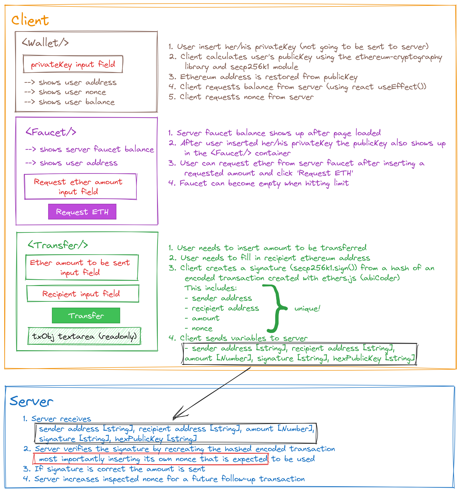

# My approach

## Starters
### Removing structural barriers
Due to functionality restrictions in the developer VM
- let nodemon run in legacy mode
- let vite watch service use polling
to achieve automatic refreshing and hot reloading.

## Basics
- [x] Modified the UI that allows the user to enter an private key that is only used locally (not sent to the server)
- [x] Wallet module can restore publicKey and ethereum address from privateKey
- [x] Wallet module can request balance from server
- [x] Wallet module can request nonce from server

- [x] Transfer module creates a signature from a hash of an encoded transaction created with ethers.js consisting of
    - [x] sender
    - [x] recipient
    - [x] amount
    - [x] nonce

- [x] Server verifies signature by recreating the hashed encoded transaction and inserting its own expectet nonce for the sending address

## Advanced
- [x] Created a server faucet that allows any address to receive Ether
- [x] Added `nonce` to the transaction object to prevent replay attacks
- [x] Played around with useEffect()

---
---

## ECDSA Node

This project is an example of using a client and server to facilitate transfers between different addresses. Since there is just a single server on the back-end handling transfers, this is clearly very centralized. We won't worry about distributed consensus for this project.

However, something that we would like to incoporate is Public Key Cryptography. By using Elliptic Curve Digital Signatures we can make it so the server only allows transfers that have been signed for by the person who owns the associated address.

### Video instructions
For an overview of this project as well as getting started instructions, check out the following video:

https://www.loom.com/share/0d3c74890b8e44a5918c4cacb3f646c4
 
### Client

The client folder contains a [react app](https://reactjs.org/) using [vite](https://vitejs.dev/). To get started, follow these steps:

1. Open up a terminal in the `/client` folder
2. Run `npm install` to install all the depedencies
3. Run `npm run dev` to start the application 
4. Now you should be able to visit the app at http://127.0.0.1:5173/

### Server

The server folder contains a node.js server using [express](https://expressjs.com/). To run the server, follow these steps:

1. Open a terminal within the `/server` folder 
2. Run `npm install` to install all the depedencies 
3. Run `node index` to start the server 

The application should connect to the default server port (3042) automatically! 

_Hint_ - Use [nodemon](https://www.npmjs.com/package/nodemon) instead of `node` to automatically restart the server on any changes.